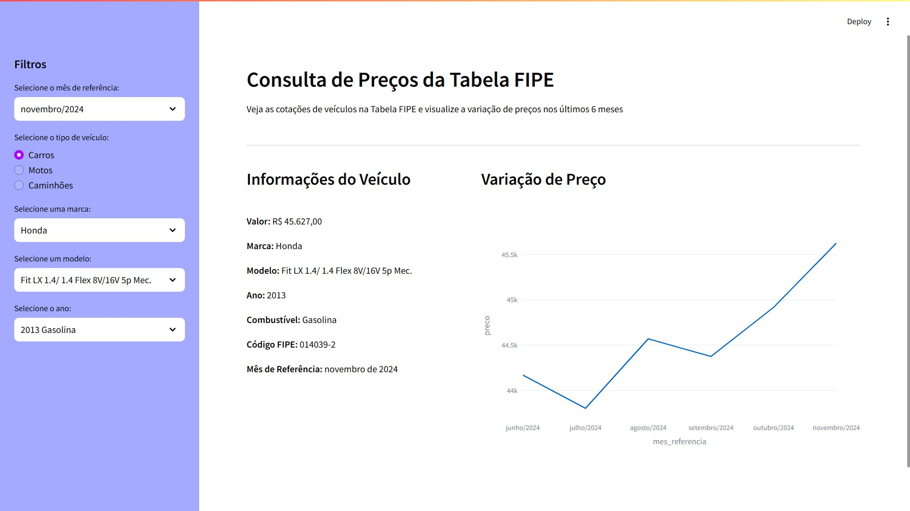

# Streamlit FIPE

## Descrição

Este projeto foi desenvolvido com o propósito de facilitar a consulta de preços de veículos utilizando a tabela FIPE. A aplicação permite que o usuário consulte o preço médio de veículos de acordo com a marca, modelo e ano de fabricação.

Além disso, a aplicação também exibe um gráfico com a evolução do preço médio do veículo ao longo dos últimos seis meses.



## Funcionamento e desenvolvimento

O projeto foi desenvolvido em Python e utiliza a biblioteca [Streamlit](https://streamlit.io/) para a criação rápida de interface web.

Os dados são obtidos a partir de chamadas REST nos endpoints disponibilizados pela API não oficial da FIPE disponível neste [link](https://deividfortuna.github.io/fipe/v2/).

## Requisitos não funcionais

- **Eficiência**: O projeto utiliza o módulo diskcache para armazenar os dados obtidos da API da FIPE. Dessa forma, a aplicação não precisa fazer requisições à API toda vez que um usuário deseja consultar um veículo, reduzindo o tempo de resposta da aplicação e evitando o consumo excessivo da API.

- **Usabilidade**: A escolha do Streamlit para o desenvolvimento da interface web foi feita com base na facilidade de uso e na simplicidade de implementação. A interface gerada é intuitiva e permite que o usuário realize consultas de forma rápida e eficiente.

## Bibliotecas utilizadas e requisitos para instalação

Este projeto foi desenvolvido utilizando Python 3.11.6 e as seguintes bibliotecas:

- requests
- streamlit
- pandas
- plotly
- python-dotenv
- diskcache

## Instalação

Este projeto requer Python 3.10.X ou superior. Recomenda-se a utilização do pyenv para gerenciar as versões do Python e evitar conflitos com outras aplicações.

### 1. Via install.sh

Execute o script install.sh para instalar as dependências do projeto.

```bash
$ chmod +x install.sh
$ ./install.sh
```

### 2. Instalação sem script

#### 2.1. Crie um ambiente virtual

##### 2.1.1 Para isolar as dependências do projeto, crie um ambiente virtual:

```bash
$ python3 -m venv venv
```

##### 2.1.2 Ative o ambiente virtual

```bash
$ source venv/bin/activate
```

Se o nome do prompt mudar para (venv), o ambiente virtual foi ativado com sucesso.

#### 2.2 Configure o arquivo .env

Mova o arquivo .env-dist para .env e preencha as variáveis de ambiente com os valores corretos.

```bash
$ mv .env-dist .env
```

#### 2.3 Instale as dependências

```bash
$ pip install -r requirements.txt
```

#### Observação final

Sempre ative o ambiente virtual antes de executar o projeto.

Para desativar o ambiente virtual ativo, execute:

```bash
$ deactivate
```

## Executar o projeto

Após a instalação das dependências, execute os comandos abaixo para iniciar a aplicação:

```bash
$ source .venv/bin/activate
$ streamlit run main.py
```